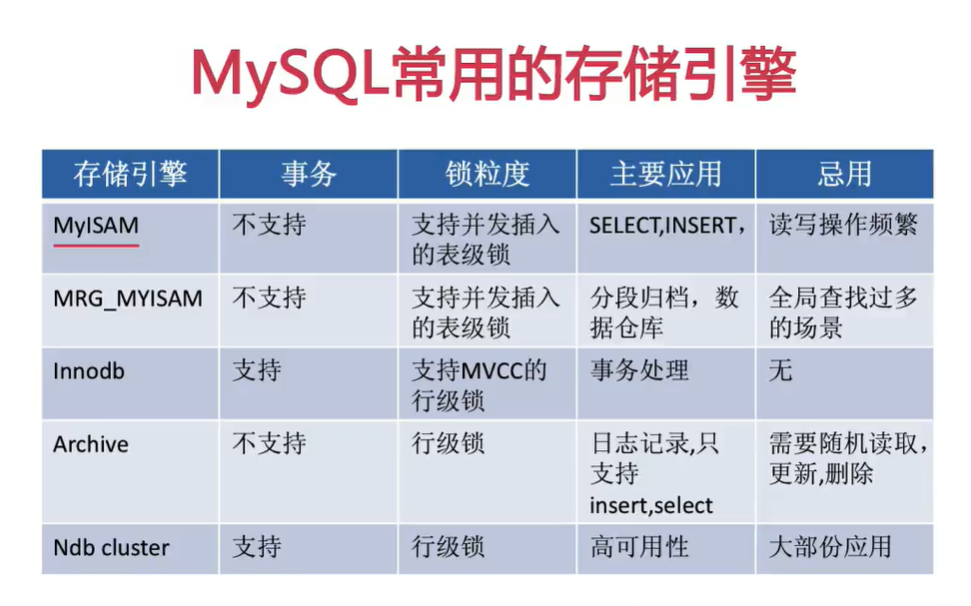

# 数据库设计笔记

数据库设计：根据业务系统的具体需求，结合我们的DBMS(数据库管理系统)，为这个业务系统构造出最优的**数据存储模型**，并建立好数据库中的**表结构**以及**表与表之间的关系**的过程

意义：好的数据库设计可以**有效的**对应用系统的数据进行存储，并能**高效的**访问数据

数据库设计步骤：需求分析--》逻辑设计--》物理设计--维护优化

需求分析：数据是什么

​                   数据有哪些属性

​                   数据和属性各自的特点有哪些

逻辑设计：使用ER图对数据库进行逻辑建模

物理设计：把逻辑模型转化成物理模型

维护优化：新的需求进行建表

​                   索引优化

​                  大表拆分

为什么要进行需求分析

```
实体即实体之间的关系(1对1，1对多，多对多)
实体所包含的属性有什么
那些属性或属性的组合可以唯一标识一个实体
```


ER图

关系：一个关系对应通常所说的一张表(个人理解为模板)

元组：表中的一行即为一个元组(理解为一个对象)

属性：表中的一列即为一个属性(理解为类的属性)

候选码：表中的某个属性组，它可以唯一确定一个元组(标识符)

主码：一个关系有多个候选码，选定其中一个为主码(唯一标识符)

域：属性的取值范围

分量：元组的一个属性值


数据库设计范式

即数据库设计的规则、规范，符合数据库设计范式会更简洁、规范、结构清晰，方便数据插入、删除等

常见数据库范式：第一、第二、第三范式和BC范式


物理设计要做什么

1.选择数据库管理系统

2.定义数据库、表即字段的命名规则

3.根据所选的DBMS系统选择合适的字段类型(例如存储一个字符串属性。时varchar还是char)

4.反范式设计(以空间换时间)


mysql常用存储引擎



表及字段的命名规则

1.可读性原则


如何区分业务主键和数据库主键：业务主键用于标识业务数据，进行表与表之间的联系

数据库主键为了优化数据存储

2.根据数据库的类型，考虑主键是否要顺序增长

3.主键的字段类型所占空间要尽可能的小

对于使用聚集索引方式存储的表，每个索引都会附加主键信息


维护和优化中要做什么

1.维护数据字典(是一种用户可以访问的记录数据库和应用程序元数据的目录,通俗来说就是表的目录结构)

2。维护索引

索引不是越多越好，过多的索引会降低读写效率，且创建过多索引维护成本高

``` mysql
ALTER TABLE `zaho_user` ADD INDEX index_username (`u_name`)
例，为zhao_user表的u_name字段添加索引
```


3.维护表结构

4.在适当的时候对表进行水平拆分或垂直拆分

