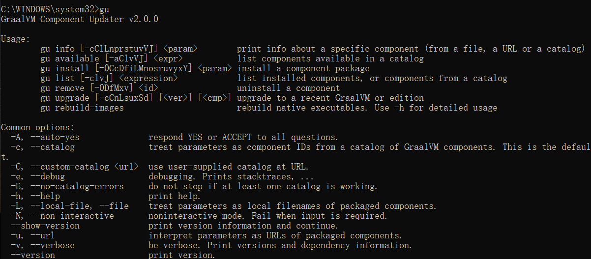

# 通过Springboot 3.0 将项目打包成 exe

## 需要的软件

Eclipse：测试运行Springboot3.0项目，导入lib

vs2022：提供 windows11SDK（**Software Develope Kit**（软件开发工具包））、<a href="[(22条消息) MSVC编译器介绍_顺其自然~的博客-CSDN博客](https://blog.csdn.net/fuhanghang/article/details/125080442)">mvsc</a>编译器组件

graalvm-ce-java17-22.3.0：使用graalvm aot编译器将java程序编译为本地机器码，大幅提升性能，根据 JDK 版本选择（选择 java17 及以上，因为 Springboot3.0 需要 jdk 至少 17）

native-image-installable-svm-java17-windows-amd64-22.3.0.jar：是一种将 Java 代码提前编译为独立可执行文件（称为**原生映像**）的技术，springboot3.0 新特性，同样通过本机的 JDK 版本与操作系统选择（要与选择的 graalvm 版本相同）

## 步骤

一、下载所需要的软件，配置好环境（Eclipse 和 vs2022 配置环境不多说）

**graalvm-ce-java17-22.3.0**

与 JDK 类似，在 path 中 编辑安装路径的 bin 目录，再到命令行输入 java - version 即可显示我们安装的 graalvm-ce(如果没有显示可以输入 gu 命令，出现反馈及安装成功)



**native-image-installable-svm-java17-windows-amd64-22.3.0.jar**

GraalVM 提供了命令行工具gu用来管理可选组件，可通过gu命令行工具来下载、删除GraalVM提供组件，所以 native-image 有两种下载方式，下载完成后输入gu list显示则安装成功

```
一：在线下载
gu install native-image
二：离线下载（需要你先下载 jar 包到本地）
gu install -L native-image
```

二、创建 Springboot 3.0 项目，编写代码，导入 lib（Springboot3.0 可以通过Spring Initializr创建，也可通过 Eclipse 创建，但注意需要导入**GraalVM Native Support**插件 ）


三、将完成的项目导入VS 中，打开x64 Native Tools Command Prompt for VS 2022，cd 到项目目录下，输入 *mvn* -Pnative native:compile 即可打包完成


